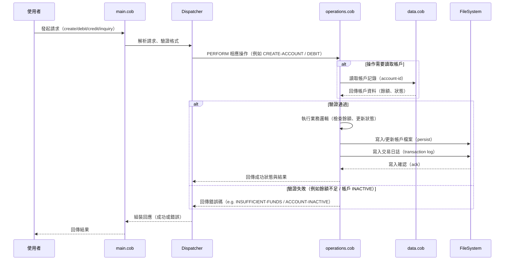

# 專案文件 — COBOL 程式說明

本文件說明 `src/cobol` 目錄下三個 COBOL 檔案的目的、主要段落/函式（procedures / paragraphs）以及與「學生帳戶（student accounts）」相關的商業規則。

> 備註：以下內容主要根據檔名與典型 COBOL 專案慣例做合理推論與說明；若要精確對應程式內部段落名稱或資料結構，請直接檢視檔案 `src/cobol/*.cob` 的 `IDENTIFICATION DIVISION`, `DATA DIVISION`, `PROCEDURE DIVISION` 內容。

## 檔案總覽

- `data.cob`
  - 目的：定義所有資料結構、檔案（FILE SECTION）、工作儲存區（WORKING-STORAGE）、常數與初始值。
  - 主要內容（典型）:
    - FILE SECTION（若程式有讀寫檔案）— 例如學生檔案、交易紀錄檔
    - WORKING-STORAGE SECTION — 變數（帳號、姓名、金額、狀態標記、錯誤碼等）
    - 01/05/… 資料定義（含 PIC 及編碼說明）
  - 注意事項：此檔案是整個應用的資料契約（schema），修改時請注意與 `operations.cob`/`main.cob` 的相容性。

- `main.cob`
  - 目的：程式的進入點（主流程），負責初始化、解析輸入（例如命令列或介面呼叫）、呼叫主要操作子程序（例如建立帳戶、執行交易）、以及最終清理與結束。
  - 主要段落/例程（典型）:
    - `MAIN-PROCEDURE` 或 `START` / `PROGRAM-ENTRY` — 程式啟動流程
    - `INITIALIZE` — 初始化資料與環境（開檔、設定預設值）
    - `DISPATCHER` 或 `ROUTER` — 根據輸入或操作碼分派到不同的業務例程（如 create, debit, credit, inquiry）
    - `CLEANUP` / `TERMINATE` — 關閉檔案、釋放資源、寫入日誌
  - 注意事項：`main.cob` 應只保留流程控制，具體商業邏輯放在 `operations.cob`，資料宣告放在 `data.cob`，以維持單一職責。

- `operations.cob`
  - 目的：實作與「學生帳戶」相關的業務邏輯與操作子程序（procedures / paragraphs），例如建立帳戶、存款、提款、查詢、驗證等。
  - 主要段落/例程（典型）:
    - `CREATE-ACCOUNT` — 建立新學生帳戶，設定初始帳號、狀態與餘額
    - `CLOSE-ACCOUNT` — 關閉或停用帳戶（轉為 `INACTIVE`）
    - `DEBIT` / `WITHDRAW` — 帳戶扣款（含檢查可用餘額、手續費）
    - `CREDIT` / `DEPOSIT` — 帳戶入帳
    - `GET-BALANCE` / `INQUIRY` — 回傳目前餘額與帳戶狀態
    - `VALIDATE-ACCOUNT` — 驗證帳號存在性、狀態（ACTIVE/INACTIVE）、是否符合操作條件
    - `LOG-TRANSACTION` —（若有）記錄交易以供追蹤與恢復
  - 注意事項：請在此處搜尋 `PERFORM` 指令以找出被呼叫的段落名稱；若需要擴充功能（例如加上交易唯一識別、並發鎖定），建議將相關程式模組化。

## 與「學生帳戶」相關的商業規則（建議與推論）

以下商業規則基於常見的學生帳戶管理需求與 COBOL 應用情境，請視專案實際程式/需求做調整：

1. 帳戶唯一性
   - 每個學生帳戶應有唯一的帳號（account-id / student-id）。建立時需檢查是否已存在，若存在回傳錯誤（例如 `DUPLICATE-ACCOUNT`）。

2. 帳戶狀態
   - 帳戶可能的狀態至少包含：`ACTIVE`、`INACTIVE`、`CLOSED`。
   - 當帳戶為 `INACTIVE` 或 `CLOSED` 時，不允許執行提款或其他會改變餘額的操作。

3. 最低/最大餘額限制
   - 若系統有最低保留金（例如學校政策要求帳戶不能低於某門檻），在 `DEBIT` 操作應先檢查扣款後是否低於門檻，並拒絕交易或收取手續費。

4. 交易驗證與原子性
   - 每筆交易應驗證來源帳號與目標帳號（若是轉帳），檢查餘額與狀態，並在成功後記錄交易日誌。
   - 若系統支援離線檔案（例：順序檔／索引檔），請在更新後確保立即寫入（或排定定期 checkpoint），以避免資料不一致。

5. 權限與輸入檢查
   - 對輸入的金額、帳號格式、日期等進行檢查（範圍、型別、長度），避免非預期資料進入系統。

6. 錯誤碼與例外處理
   - 使用一致的錯誤碼（error-codes）與回報機制，`operations.cob` 的每個段落在返回時應設定狀態碼讓 `main.cob` 決定後續流程（如重試、回滾或通知）。

7. 帳務日（Business Day）處理（若適用）
   - 若學校管理有「營業日」概念（例如跨夜利息、批次結帳），請在 `main.cob` 或批次流程加入日終處理（EOD）的例程。

## 建議的閱讀路徑（快速定位）

1. 先開 `src/cobol/data.cob`，確認 `WORKING-STORAGE` 與 `FILE SECTION` 的變數名稱與資料型別。
2. 打開 `src/cobol/operations.cob`，尋找 `PERFORM` 可被呼叫的段落名稱（例如 `CREATE-ACCOUNT`, `DEBIT`, `CREDIT`）。
3. 回到 `src/cobol/main.cob`，檢查主流程如何解析輸入與分派（dispatcher），以及錯誤如何被處理與回報。

## 改善與測試建議

- 新增單元測試或自動化腳本（若環境允許），例如用小型資料檔（fixture）測試 `CREATE-ACCOUNT`、`DEBIT` 的邏輯。
- 將常數（狀態、錯誤碼、最低餘額）集中在 `data.cob` 的常數區，並加上清楚註解。
- 若可能，將商業邏輯抽成可獨立測試的小例程，避免大型的單一段落難以測試與維護。

## 聯絡與後續事項

若你希望我：
- 直接從檔案中抽取段落名稱與實際欄位描述，我可以讀取 `src/cobol/*.cob` 並把精確內容填回本 README（需你允許我讀取檔案）。
- 幫你建立簡單的變更範本（例如新增 `VALIDATE-AGE` 或 `MIN-BALANCE` 的常數與測試案例），我也可以幫忙實作。

---

文件建立於專案分支 `modernize-legacy-code`，如需調整語言或增加範例片段請告訴我。

## 序列圖（資料流程）

下面的 Mermaid 序列圖示範了使用者請求如何在程式中流動：從 `main.cob` 進入、被 dispatcher 解析與分派、在 `operations.cob` 中執行業務邏輯，並透過 `data.cob` / 檔案系統完成讀寫與交易記錄。

此序列圖為高階視圖，描述主要資料流與責任分界。實作細節（如檔案鎖、交易回滾、批次 EOD 流程）可視專案需求再補充。